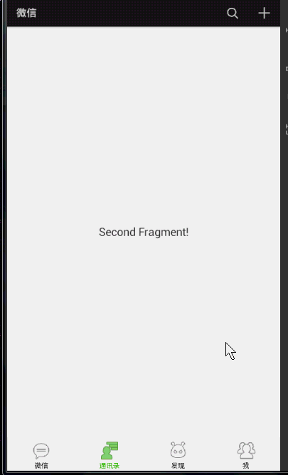
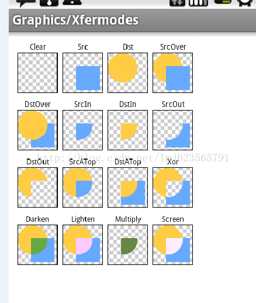

在慕课网上学习了张鸿阳老师的高仿微信6.0 Android界面的课程，在此记录下学习笔记。
<!-- More -->
这里借用下老师的动态图，自己的App界面图标比较丑，网上找了几个icon作为绘制标本。


## 变色原理介绍
### Graphics/Xfermode原理图

### 步骤
这里主要是利用了Paint的Xfermode，使用的是Mode.DST_IN模式
1. 绘制Dst图
2. 绘制Src图
3. 在此模式下，显示的是Dst和Src的交集区域，填充内容为Dst的图片内容

## 自定义底部的TabView步骤
### 定义属性文件**attr.xml**

   ```xml
   <?xml version="1.0" encoding="utf-8"?>
   <resources>
       <attr name="icon" format="reference"></attr>
       <attr name="color" format="color"></attr>
       <attr name="text" format="string"></attr>
       <attr name="text_size" format="dimension"></attr>

       <declare-styleable name="ChangeIconWithText">
           <attr name="icon"></attr>
           <attr name="color"></attr>
           <attr name="text"></attr>
           <attr name="text_size"></attr>
       </declare-styleable>
   </resources>
   ```

### 在布局文件**activity_wechat.xml**中使用我们定义好的**attr.xml**属性文件，这一步需要记得设置命名空间

   ```xml
    <!--这里设置命名空间-->
   <LinearLayout xmlns:android="http://schemas.android.com/apk/res/android"
       xmlns:tools="http://schemas.android.com/tools"
       xmlns:zxx="http://schemas.android.com/apk/res-auto"
       android:layout_width="match_parent"
       android:layout_height="match_parent"
       android:orientation="vertical">
   ```

   ```xml
   <!-- 使用attr.xml定义的属性 -->
   <com.example.simonzheng.demo1.ChangeIconWithText
       android:id="@+id/id_indicator_one"
       android:layout_width="0dp"
       android:layout_height="match_parent"
       android:layout_weight="1"
       android:padding="5dp"
       zxx:color="#ff45c01a"
       zxx:icon="@drawable/wechat"
       zxx:text="@string/app_name_wechat"
       zxx:text_size="12sp" />
   ```

### 在构造方法中去获取自定义的属性，这里的目的是获得这些值，为后面的绘制做准备

   ```java
   public ChangeIconWithText(Context context, @Nullable AttributeSet attrs, int defStyleAttr) {
       super(context, attrs, defStyleAttr);

       TypedArray a = context.obtainStyledAttributes(attrs, R.styleable.ChangeIconWithText);

       int n = a.getIndexCount();

       for (int i = 0; i < n; i++) {
           int attr = a.getIndex(i);
           switch (attr) {
               case R.styleable.ChangeIconWithText_icon:
                   BitmapDrawable drawable = (BitmapDrawable) a.getDrawable(attr);
                   mIconBitmap = drawable.getBitmap();
                   break;
               case R.styleable.ChangeIconWithText_color:
                   mColor = a.getColor(attr, 0xff45c01a);
                   break;
               case R.styleable.ChangeIconWithText_text:
                   mText = a.getString(attr);
                   break;
               case R.styleable.ChangeIconWithText_text_size:
                   mTextSize = (int) a.getDimension(attr, TypedValue.applyDimension(TypedValue.COMPLEX_UNIT_SP, 12, getResources().getDisplayMetrics())
                   );
                   break;
           }
       }
       a.recycle();

       mTextBound = new Rect();
       mTextPaint = new Paint();
       mTextPaint.setTextSize(mTextSize);
       mTextPaint.setColor(0xff555555);
       mTextPaint.getTextBounds(mText, 0, mText.length(), mTextBound);
   }
   ```

### 实现onMeasure方法

   ```java
   /**
    * icon的边长： view的宽度 - leftpadding - rightpadding
    * view的高度 - toppadding - bottompadding - mTextBound.height
    *
    * @param widthMeasureSpec
    * @param heightMeasureSpec
    */
   @Override
   protected void onMeasure(int widthMeasureSpec, int heightMeasureSpec) {
       super.onMeasure(widthMeasureSpec, heightMeasureSpec);
       int iconWidth = Math.min(getMeasuredWidth() - getPaddingLeft() - getPaddingRight(),
               getMeasuredHeight() - getPaddingTop() - getPaddingBottom() - mTextBound.height());

       int left = getMeasuredWidth() / 2 - iconWidth / 2;
       int top = getMeasuredHeight() / 2 - (mTextBound.height() + iconWidth) / 2;

       mIconRect = new Rect(left, top, left + iconWidth, top + iconWidth);

   }
   ```

### 实现onDraw方法

   ```java
   @Override
   protected void onDraw(Canvas canvas) {
       //绘制原图
       canvas.drawBitmap(mIconBitmap, null, mIconRect, null);
       //内存中准备mBitmap, setAlpha, 纯色, xfermode, 图标
       int alpha = (int) Math.ceil(255 * mAlpha);
       setupTargetBitmap(alpha);
       //绘制原文本
       drawSourceText(canvas, alpha);
       //绘制变色文本
       drawTargetText(canvas, alpha);
       canvas.drawBitmap(mBitmap, 0, 0, null);
       super.onDraw(canvas);
   }

   /**
    * 绘制变色文本
    *
    * @param canvas
    * @param alpha
    */
   private void drawTargetText(Canvas canvas, int alpha) {
       mTextPaint.setColor(mColor);
       mTextPaint.setAlpha(alpha);
       int x = getMeasuredWidth() / 2 - mTextBound.width() / 2;
       int y = mIconRect.bottom + mTextBound.height();
       canvas.drawText(mText, x, y, mTextPaint);
   }

   /**
    * 绘制原文本
    *
    * @param canvas
    * @param alpha
    */
   private void drawSourceText(Canvas canvas, int alpha) {
       mTextPaint.setColor(0xff333333);
       mTextPaint.setAlpha(255 - alpha);
       int x = getMeasuredWidth() / 2 - mTextBound.width() / 2;
       int y = mIconRect.bottom + mTextBound.height();
       canvas.drawText(mText, x, y, mTextPaint);
   }

   /**
    * 在内存中绘制可变色icon
    */
   private void setupTargetBitmap(int alpha) {
       mBitmap = Bitmap.createBitmap(getMeasuredWidth(), getMeasuredHeight(), Bitmap.Config.ARGB_8888);
       mCanvas = new Canvas(mBitmap);
       mPaint = new Paint();
       mPaint.setColor(mColor);
       mPaint.setDither(true);
       mPaint.setAntiAlias(true);
       mPaint.setAlpha(alpha);
       mCanvas.drawRect(mIconRect, mPaint);
       mPaint.setXfermode(new PorterDuffXfermode(PorterDuff.Mode.DST_IN));
       mPaint.setAlpha(255);
       mCanvas.drawBitmap(mIconBitmap, null, mIconRect, mPaint);
   }
   ```

### ViewPager在滑动的时候，positionOffset的值会从0到1改变，可以通过这个值来改变图标的alpha值，从而达到图标颜色渐变的效果

   ```java
   @Override
   public void onPageScrolled(int position, float positionOffset, int positionOffsetPixels) {
       Log.d("TAG", "position= " + position + ", " + positionOffset);
       if (positionOffset > 0) {
           ChangeIconWithText left = mTabIndicators.get(position);
           ChangeIconWithText right = mTabIndicators.get(position + 1);
           left.setIconAlpha( 1- positionOffset);
           right.setIconAlpha(positionOffset);
       }
   }
   ```

## 在实现顶部menu的过程中的一些小注意事项

### AppCompatActivity

这里我的Wechat activity继承自AppCompatActivity，在这里为了让右上角的弹出菜单能够显示icon，视频中是在重写onMenuOpened的方法。但是在AppCompatActivity，我们需要把强制设置图标显示的代码放到onPrepareOptionsMenu方法中，像这样：

```java
@Override
public boolean onPrepareOptionsMenu(Menu menu) {
    if (menu != null) {
        if (menu.getClass().getSimpleName().equals("MenuBuilder")) {
            try {
                Method m = menu.getClass().getDeclaredMethod("setOptionalIconsVisible", Boolean.TYPE);
                m.setAccessible(true);
                m.invoke(menu, true);
            } catch (NoSuchMethodException e) {
                e.printStackTrace();
            } catch (IllegalAccessException e) {
                e.printStackTrace();
            } catch (InvocationTargetException e) {
                e.printStackTrace();
            }
        }
    }
    return super.onPrepareOptionsMenu(menu);
}
```


### 替换右上角的菜单按钮

1. 在styles.xml文件中写样式去替换相应的图标, 这里由于我的icon为透明色，跟弹出菜单的底色搭配后显得看不清，于是我做了修改去把颜色改为黑灰色，并且把菜单项的颜色改为了白色。

   ```xml
   <style name="MyTheme" parent="Theme.AppCompat.Light.DarkActionBar">
       <item name="android:actionOverflowButtonStyle">@style/WechatActionOverflowButtonStyle</item>
       <item name="actionOverflowButtonStyle">@style/WechatActionOverflowButtonStyle</item>
       <item name="actionOverflowMenuStyle">@style/WechatPopupMenuStyle</item>
       <item name="android:itemTextAppearance">@style/WechatPopupMenuTextStyle</item>
   </style>

   <style name="WechatActionOverflowButtonStyle">
       <item name="android:src">@drawable/actionbar_add_icon</item>
   </style>

   <style name="WechatPopupMenuStyle" parent="Theme.AppCompat.CompactMenu">
       <item name="android:popupBackground">@color/colorGrayDark</item>
   </style>

   <style name="WechatPopupMenuTextStyle">
       <item name="android:textColor">@color/colorWhite</item>
   </style>
   ```

2. 如下代码是用来强制把菜单第一项和菜单icon合并的代码，在这里我用的是AppCompatActivity，以下代码对于我的app貌似无效，我的做法是去掉了菜单列表的Add item。

   ```java
   private void setOverflowButtonAlways() {
       try {
           ViewConfiguration config = ViewConfiguration.get(this);
           Field menuKey = ViewConfiguration.class.getDeclaredField("sHasPermanentMenuKey");
           menuKey.setAccessible(true);
           menuKey.setBoolean(config, false);
       } catch (NoSuchFieldException e) {
           e.printStackTrace();
       } catch (IllegalAccessException e) {
           e.printStackTrace();
       }
   }
   ```

### 防止程序被Kill后，Tab的状态和ViewPager状态不同步的问题

在程序被Kill了以后，我们的Tab状态和ViewPager无法同步，视频中是使用横竖屏来强制页面重绘来模拟这个情况，我们需要复写如下方法并保存tab的状态：

```java
private static final String INSTANCE_STATUS = "instance_status";
private static final String STATUS_ALPHA = "status_alpha";

@Override
protected Parcelable onSaveInstanceState() {
    Bundle bundle = new Bundle();
    bundle.putParcelable(INSTANCE_STATUS, super.onSaveInstanceState());
    bundle.putFloat(STATUS_ALPHA, mAlpha);
    return bundle;
}

@Override
protected void onRestoreInstanceState(Parcelable state) {
    if (state instanceof Bundle) {
        Bundle bundle = (Bundle) state;
        mAlpha = bundle.getFloat(STATUS_ALPHA);
        super.onRestoreInstanceState(bundle.getParcelable(INSTANCE_STATUS));
        return;
    }
    super.onRestoreInstanceState(state);
}
```

以上就是这次的学习笔记，更多详情可以参考下老师的博客：[Android 高仿微信6.0主界面 带你玩转切换图标变色 ](http://blog.csdn.net/lmj623565791/article/details/41087219)

